# Multi гайд по настройке для VLESS REALITY XHTTP с SELF STEAL SNI на Ubuntu:

[Как правильно настроить SSH на Linux](#Как-правильно-настроить-SSH-на-Linux)

[Настройка Firewall](#Настройка-Firewall)

[Настройка Fail2Ban](#Настройка-Fail2Ban)

[Настройка DNS в системе](#Настройка-DNS-в-системе)

[Установка и настройка 3x-ui](#Установка-и-настройка-3x-ui)

[Настройка DoH в XRAY](#Настройка-DoH-в-XRAY)

[Настройка GEO баз от runetfreedom](#Настройка-GEO-баз-от-runetfreedom)

[Настройка SELF STEAL SNI](#Настройка-SELF-STEAL-SNI)

[Объединение нескольких панелей 3x-ui в подписку для клиентов](#Объединение-нескольких-панелей-3x-ui-в-подписку-для-клиентов)

[Настройка инбаунда VLESS XHTTP + REALITY](#Настройка-инбаунда-VLESS-XHTTP-+-REALITY)

## Как правильно настроить SSH на Linux

Самая надёжная базовая схема такая: создаем отдельного пользователя, входим по SSH-ключу, а административные действия выполняем через sudo. Root-логин напрямую не используем, а вход по паролю и пароль для использования команд sudo отключаем. Тогда даже если кто-то будет круглосуточно «стучаться» в SSH, он упрётся в отсутствие паролей как класса.

1. Генерация публичного (.pub) и приватного ключей на ПК в Windows PowerShell в папке Downloads

```
ssh-keygen -t rsa -b 4096 -f "$HOME\Downloads\id_rsa"
```
2. Настройка нового пользователя (замените USER_NAME на имя вашего пользователя) на вашем сервере

```
sudo adduser USER_NAME
sudo usermod -aG sudo USER_NAME
sudo bash -c 'echo "USER_NAME ALL=(ALL) NOPASSWD:ALL" > /etc/sudoers.d/USER_NAME'
sudo chmod 440 /etc/sudoers.d/USER_NAME
```
3. Подготовка папки ключей и выдача прав (замените USER_NAME на имя вашего пользователя)

```
sudo mkdir -p /home/USER_NAME/.ssh
sudo touch /home/USER_NAME/.ssh/authorized_keys
sudo chown -R USER_NAME:USER_NAME /home/USER_NAME/.ssh
sudo chmod 700 /home/USER_NAME/.ssh
sudo chmod 600 /home/USER_NAME/.ssh/authorized_keys
```

4. Добавление/Замена ключа. Вставьте ваш публичный ключ (содержимое файла .pub с ПК) в редактор:

```
sudo nano /home/USER_NAME/.ssh/authorized_keys
```

5. Перезагружаем SSH 

```
sudo systemctl restart ssh
```
6. Через Windows PowerShell проверяем доступ к серверу по добавленному ключу (обязательно! чтобы не закрыть себе доступ)

```
ssh -i "KEY_PATH" USER_NAME@SERVER_IP
```

Если выдает ошибку, что ключ UNDETECTED нужно отключить наследование для приватного (!!! НЕ .pub) ключа:

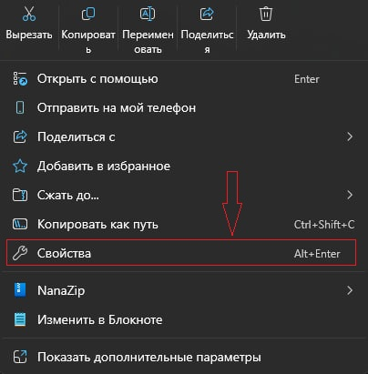

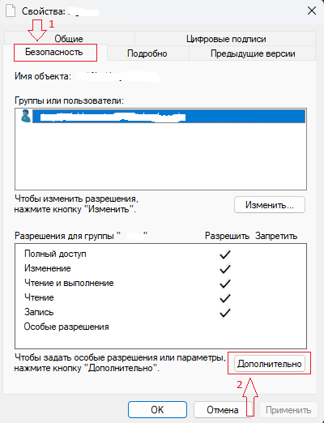

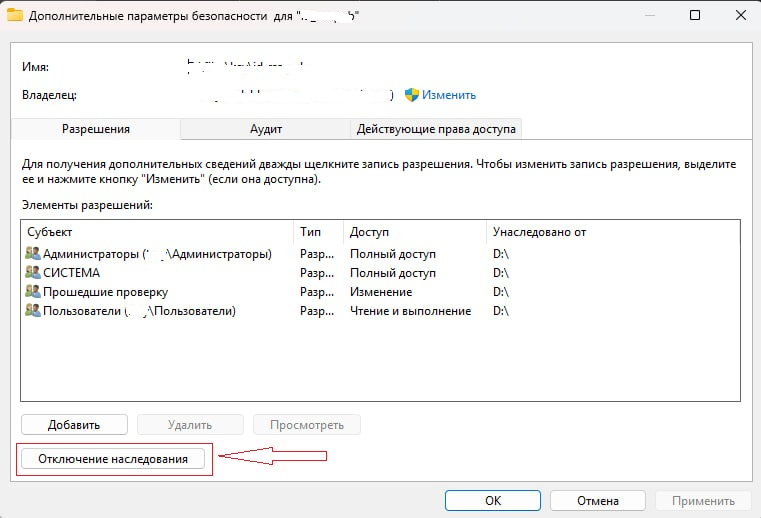

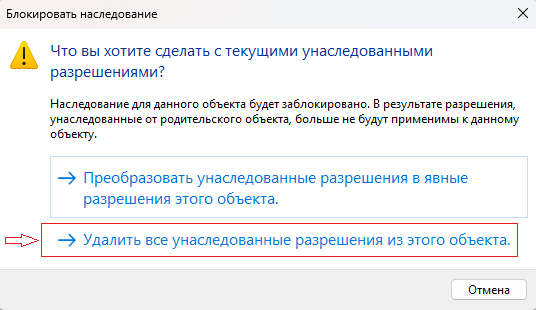

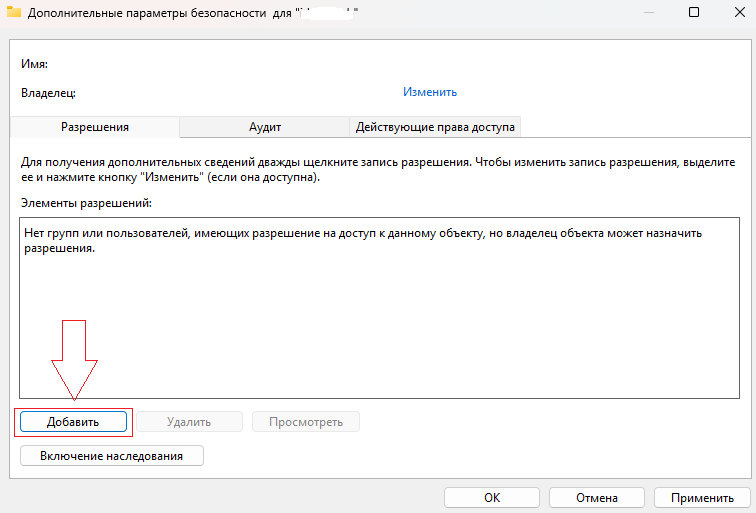

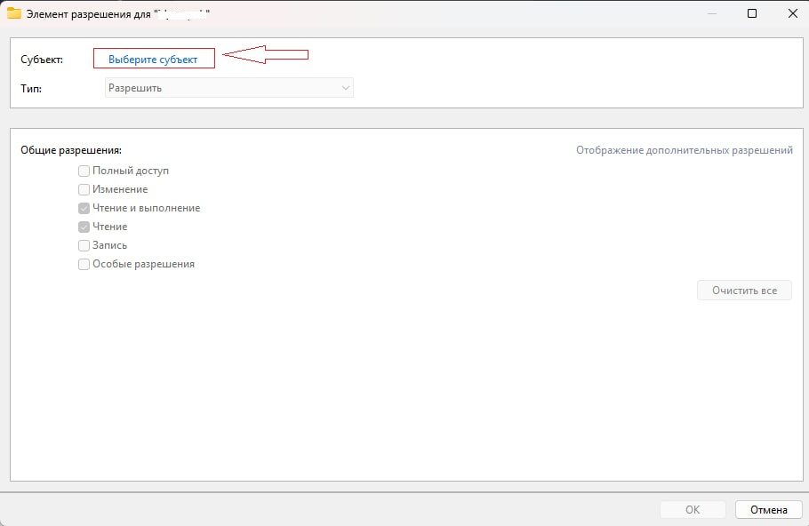

*Вместо WINDOWS_USER_NAME пишем имя вашего юзера Windows*

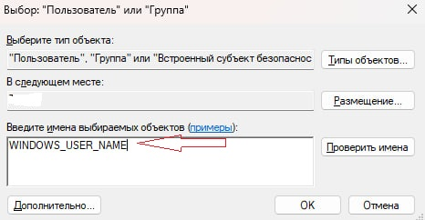

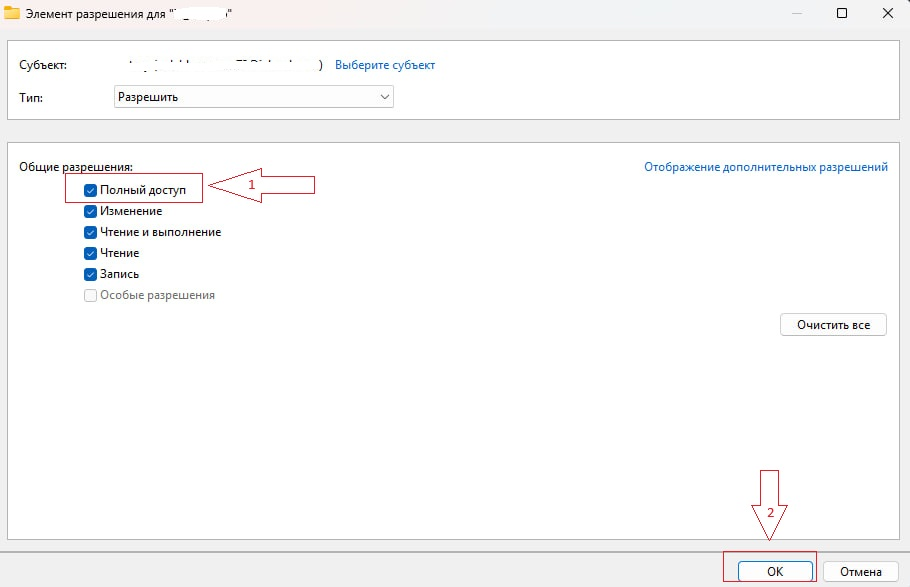

7. Если вы смогли зайти по SSH отключаем пароли и ROOT-вход

```
sudo sed -i -E 's/^#?PermitRootLogin.*/PermitRootLogin no/' /etc/ssh/sshd_config /etc/ssh/sshd_config.d/50-cloud-init.conf
sudo sed -i -E 's/^#?PasswordAuthentication.*/PasswordAuthentication no/' /etc/ssh/sshd_config /etc/ssh/sshd_config.d/50-cloud-init.conf
sudo sed -i -E 's/^#?PubkeyAuthentication.*/PubkeyAuthentication yes/' /etc/ssh/sshd_config /etc/ssh/sshd_config.d/50-cloud-init.conf
sudo sed -i -E 's/^#?KbdInteractiveAuthentication.*/KbdInteractiveAuthentication no/' /etc/ssh/sshd_config /etc/ssh/sshd_config.d/50-cloud-init.conf
```

!!! в папке **/etc/ssh/sshd_config.d/** могут быть и другие файлы .conf, созданные различными программами, поэтому если команда сверху не сработала то имйте ввиду, что какой-то конфиг берет приоритет над **50-cloud-init.conf**

Перезагружаем SSH и проверяем итоговые значения:
```
sudo systemctl restart ssh
```
```
sudo sshd -T | grep -E 'permitrootlogin|passwordauthentication|pubkeyauthentication|kbdinteractiveauthentication'
```

Вывод должен быть:
```
permitrootlogin no
passwordauthentication no 
pubkeyauthentication yes
kbdinteractiveauthentication no
```

## Настройка Firewall

1. Ставим и включаем

```
sudo apt update
sudo apt install -y ufw
sudo ufw default deny incoming
sudo ufw default allow outgoing
```

2. Рекомендуется открывать только нужные порты. Также можно открыть порт только для вашего айпи (например для безопасного доступа к панели)

Открытие обязательных портов. Другие добавляются по такому же примеру:
```
sudo ufw allow 22/tcp
sudo ufw allow 80/tcp
sudo ufw allow 443/tcp
```

Открытие порта для определенного айпи:

```
sudo ufw allow from ВАШ_IP to any port ВАШ_ПОРТ proto tcp
```

Включение UFW:

```
sudo ufw enable
```

Проверка:
```
sudo ufw status
```

Закрытие порта:
```
sudo ufw delete allow ВАШ_ПОРТ/tcp
```
```
sudo ufw delete allow from ВАШ_IP to any port ВАШ_ПОРТ proto tcp
```

Выключение UFW:
```
sudo ufw disable
```

Сброс UFW:
```
sudo ufw reset
```

## Настройка Fail2Ban

Даже при входе по ключам полезно включить защиту от перебора. Он автоматически блокирует IP, которые пытаются ломиться в SSH/RDP/веб-авторизацию. В итоге меньше мусора в логах, меньше попыток подобрать что-либо и проще заметить настоящую проблему.

1. Установка:
```
sudo apt update
sudo apt install -y fail2ban
```

2. Создать локальный конфиг:
```
sudo nano /etc/fail2ban/jail.local
```

3. Пример конфига:
```
[sshd]
enabled = true
maxretry = 5
findtime = 10m
bantime  = 1h
```

4. Запуск:
```
sudo systemctl enable --now fail2ban
sudo fail2ban-client status sshd
```

5. Остановка сервиса и отключение автозапуска:
```
sudo systemctl stop fail2ban
```
```
sudo systemctl disable fail2ban
```

6. Разбан IP
```
sudo fail2ban-client set sshd unbanip IP
```

## Настройка DNS в системе

В XRAY мы в любом случае не будем использовать системный днс, но на некоторых хостингах вписаны только локальные днс, что может повысить пинг в системе, а также ограничить доступ к некоторым репозиториям(особенно на серверах с ТСПУ). Поэтому мы пропишем нормальные днс в Global.

```
sudo nano /etc/systemd/resolved.conf
```

В строке #DNS= удаляем # и вписываем 1.1.1.1 8.8.8.8
Должно получиться: DNS=1.1.1.1 8.8.8.8

Нажимаем Ctrl+O, Enter, Ctrl+X

Перезагружаем:
```
sudo systemctl restart systemd-resolved
```

Проверяем:
```
resolvectl status
```

## Установка и настройка 3x-ui

3x-ui на данный момент самая юзер френдли панель для xray. Ставится и удаляется она довольно чисто, но мы рассмотрим и вариант для параноиков с установкой в Docker.

Изначально установим пакеты:
```
apt update && apt upgrade -y
apt install -y curl nano cron
systemctl enable --now cron

curl https://get.acme.sh | sh
source ~/.bashrc
```

Установка 3x-ui через Docker:
```
bash <(curl -sSL https://get.docker.com)
git clone https://github.com/mhsanaei/3x-ui.git
cd 3x-ui
docker compose up -d
```

Ручная установка 3x-ui:
```
bash <(curl -Ls https://raw.githubusercontent.com/mhsanaei/3x-ui/master/install.sh)
```

При установке оставляем все по умолчанию, протыкиваем везде Enter, самоподписанный сертификат будет выдан на ваш IP через Acme.
В конце установки вам будут выданы Логин, Пароль и Ссылка на вашу панель:


Обязательно прописываем x-ui, выбираем пункт Enable BBR, 1, Enter

## Настройка DoH в XRAY

Заходим в панель в браузере 

Настройки Xray - Основное 

Настройка стратегии протокола Freedom: ForceIP (если у вас есть IPv6) или ForceIPv4 (если только IPv4)

Настройка маршрутизации доменов IPIfNonMatch

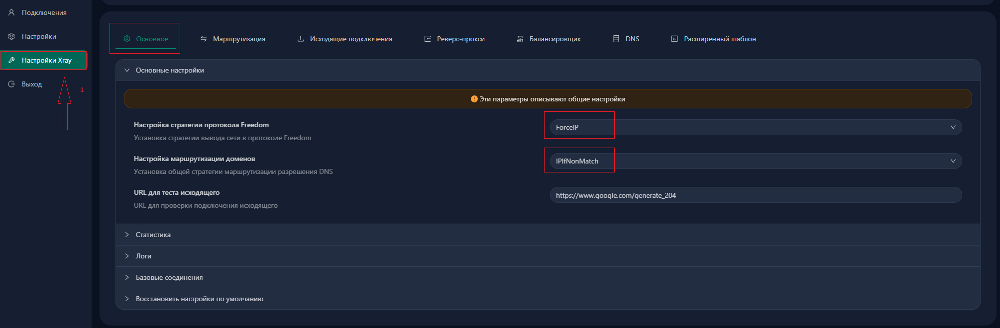

Настройки Xray - DNS

Стратегия запроса: UseIP (если у вас есть IPv6) или UseIPv4 (если только IPv4)

Включить параллельные запросы - включаем

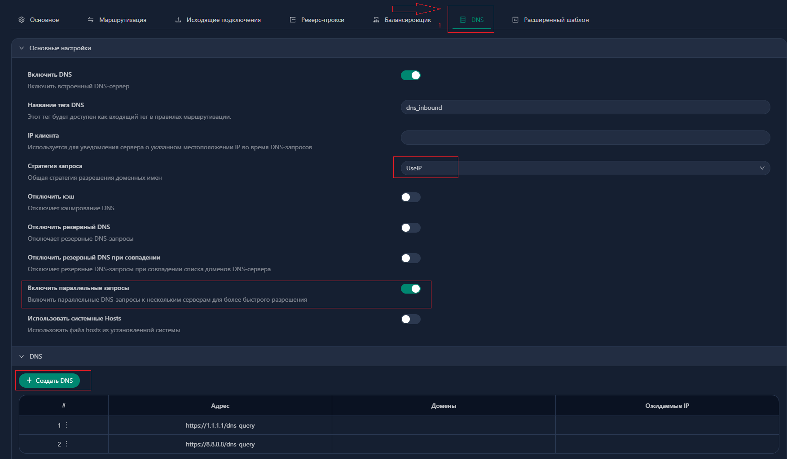

Нажимаем создать DNS

Адрес https://1.1.1.1/dns-query (и вторую запись но с https://8.8.8.8/dns-query)

Порт 443

Стратегия запроса UseIP (если у вас есть IPv6) или UseIPv4 (если только IPv4)

Skip Fallback - отключаем

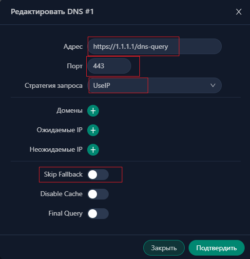

Перезагружаем Xray

## Настройка GEO баз от runetfreedom

Встроенные в xray базы geosite и geoip не включают списки заблокированных в РФ сервисов. Поэтому дабы мы могли удобно настраивать маршрутизацию лучше поставить данные геобазы, мы создадим скрипт для удобного обновления. Скрипт ничего не ломает, если обновить геобазы через x-ui они просто заменят наши гео.

Создаем файл скрипта:
```
nano /usr/local/bin/update-xray-geo.sh
```

Вставляем текст:
```
#!/bin/bash

# Путь к папке
GEO_DIR="/usr/local/x-ui/bin"

# Ссылки на файлы
GEOIP_URL="https://github.com/runetfreedom/russia-v2ray-rules-dat/releases/latest/download/geoip.dat"
GEOSITE_URL="https://github.com/runetfreedom/russia-v2ray-rules-dat/releases/latest/download/geosite.dat"

echo "Начинаю обновление баз..."

# Скачиваем во временные файлы
curl -L -o "$GEO_DIR/geoip.dat.tmp" $GEOIP_URL
curl -L -o "$GEO_DIR/geosite.dat.tmp" $GEOSITE_URL

# Проверка, что файлы скачались и они не пустые (больше 100 Кб)
if [ -s "$GEO_DIR/geoip.dat.tmp" ] && [ -s "$GEO_DIR/geosite.dat.tmp" ]; then
    
    # Удаляем старые файлы
    rm -f "$GEO_DIR/geoip.dat"
    rm -f "$GEO_DIR/geosite.dat"
    
    # Перемещаем новые на их место
    mv "$GEO_DIR/geoip.dat.tmp" "$GEO_DIR/geoip.dat"
    mv "$GEO_DIR/geosite.dat.tmp" "$GEO_DIR/geosite.dat"
    
    echo "Файлы успешно заменены. Перезапуск службы x-ui..."
    systemctl restart x-ui
    echo "Готово!"
else
    echo "Ошибка: загрузка не удалась, старые файлы не были удалены."
    rm -f "$GEO_DIR/geoip.dat.tmp" "$GEO_DIR/geosite.dat.tmp"
    exit 1
fi
```

Нажимаем Ctrl + O, Enter, Ctrl + X

Делаем скрипт исполняемым:
```
chmod +x /usr/local/bin/update-xray-geo.sh
```

Запускаем:
```
bash /usr/local/bin/update-xray-geo.sh
```

## Настройка SELF STEAL SNI 

(https://github.com/YukiKras/wiki/blob/main/selfsni.md)

Для начала вам нужно приобрести домен и создать DNS A запись, чтобы за доменом стоял айпи вашего vps:

A @ ВАШ_IP

Как только на 2ip.ru увидите, что ваш домен привязан к вашему айпи, запускаем скрипт:
```
bash <(curl -Ls https://raw.githubusercontent.com/YukiKras/vless-scripts/refs/heads/main/fakesite.sh)
```

Вводим ваш домен

Скрипт выдаст пути к сертификатам (Certbot), ваши TARGET (DEST) и SNI, а также создаст сайт заглушку на Nginx. Копируем пути к сертфикатам (/etc/letsencrypt/live/your-domain.com/fullchain.pem /etc/letsencrypt/live/your-domain.com/privkey.pem), TARGET (DEST) и SNI

Теперь нам нужно сменить сертификаты панели на новые (т.к. будет конфликт за 80 порт, когда Acme решит продлить ваши сертификаты на IP) и удалить задачу автозапуска Acme из crontab

Заходим в панель в браузере - Настройки 

Домен панели - вводим ваш домен, на который выдавались сертификаты

Во вкладке Сертификаты вставляем пути, которые вам выдал скрипт формата (/etc/letsencrypt/live/your-domain.com/fullchain.pem /etc/letsencrypt/live/your-domain.com/privkey.pem)

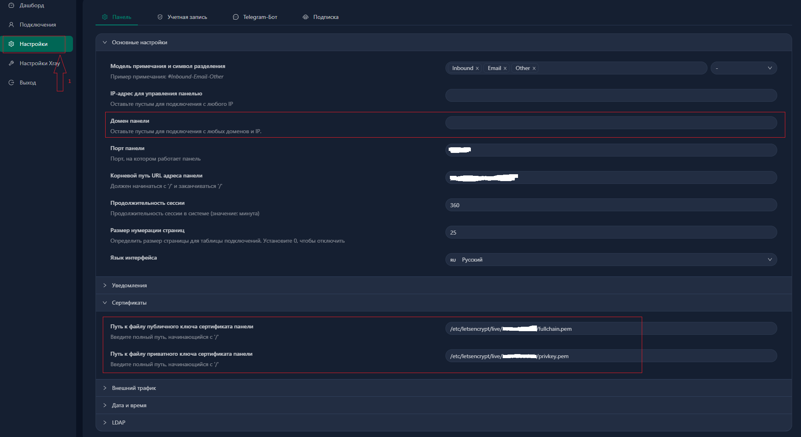

Нажимаем Перезапуск панели 

Узнать новую ссылку можно прописав в консоль x-ui и выбрав пункт View current settings

Теперь удаляем задачу ACME из crontab
```
crontab -e
```

Выбираем режим nano (обычно цифра 1) и стираем строчку, которая относится к acme, нажимаем Ctrl + O, Enter, Ctrl + X

Перезапускаем x-ui:
```
sudo systemctl restart x-ui
```

## Объединение нескольких панелей 3x-ui в подписку для клиентов 

(https://github.com/apa4h/nginx-3x-ui-subscription-proxy)

Установка Docker:
```
curl -fsSL https://get.docker.com | sh
```

Клонируем с гитхаба:
```
git clone https://github.com/apa4h/nginx-3x-ui-subscription-proxy.git
```

```
cd nginx-3x-ui-subscription-proxy
```

```
cp .env.template .env
```

```
nano .env
```

Пример конфига:
```
PATH_SSL_KEY=/etc/letsencrypt/live/example.com/
SITE_HOST=example.com
SITE_PORT=8080
SERVERS="https://server1.com:2096/sub/ https://server2.com:2096/sub/"
SUB=sub
TLS_MODE=on
```

В PATH_SSL_KEY и SITE_HOST вводим наш домен вместо example.com

SITE_PORT выбираем свободный порт (не забываем открыть его, а также 2096 в файрволе)

В SERVERS вводим ссылки на ваши панели

TLS_mode ставим on

Собираем контейнер:
```
docker compose up -d
```

Если нужно остановить:
```
docker compose down
```

Далее в инбаундах 3x-ui в указанных панелях нужно в настройках Клиентов указать одинаковый EMAIL, который мы и укажем в ссылке на подписку. Клиенты с этим EMAIL будут автоматически подтягиваться в подписку.

Ссылка на подписку: https://example.com:8080/sub/ВАШ_EMAIL

## Настройка инбаунда VLESS XHTTP + REALITY

Порт 443

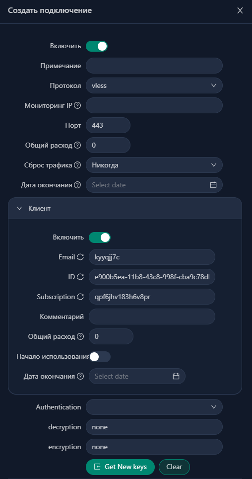

Транспорт XHTTP

Хост ваш-домен

Путь /любой/длинный/путь/

Заголовок запроса - нажимаем +
```
User-Agent
```
```
Mozilla/5.0 (Windows NT 10.0; Win64; x64) AppleWebKit/537.36 (KHTML, like Gecko) Chrome/122.0.0.0 Safari/537.36
```

Padding Obfs Mode включаем

Padding Key: 
```
x_padding
```

Padding Header:
```
Referer
```

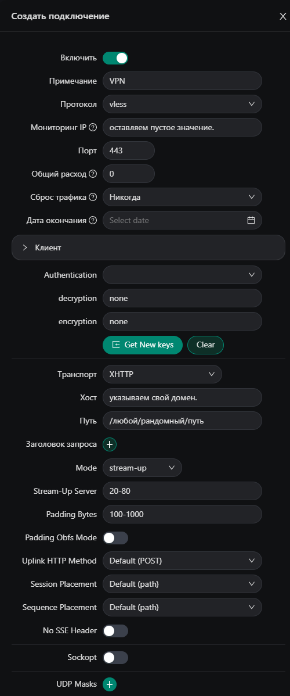

Безопасность Reality

Xver 1

Target ваш-скопированный-target
SNI ваш-домен

Генерируем сертификаты кнопкой Get New Cert

Обязательно включаем Sniffing, чтобы корректно работала маршрутизация

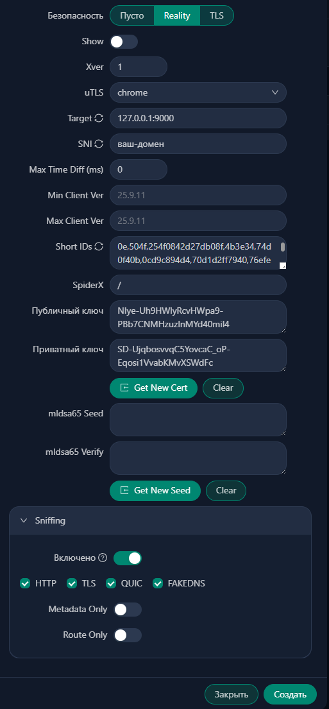
