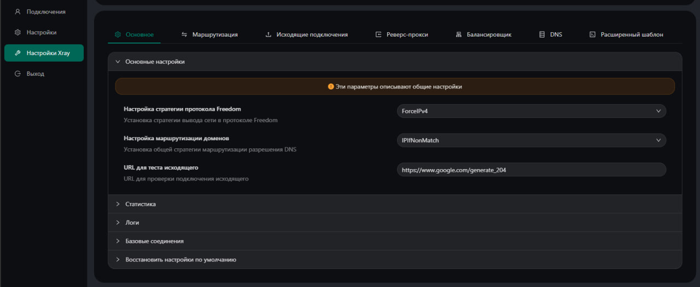
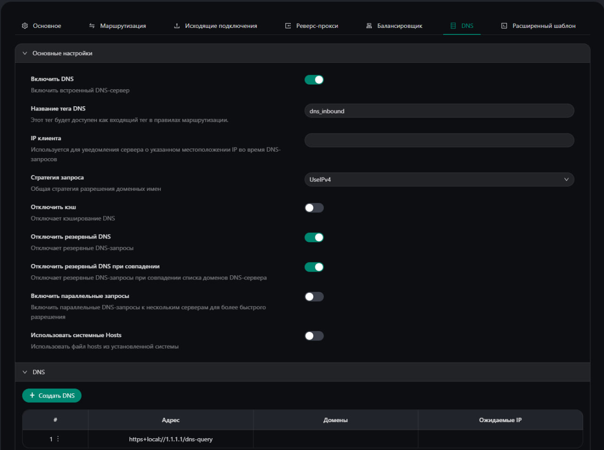
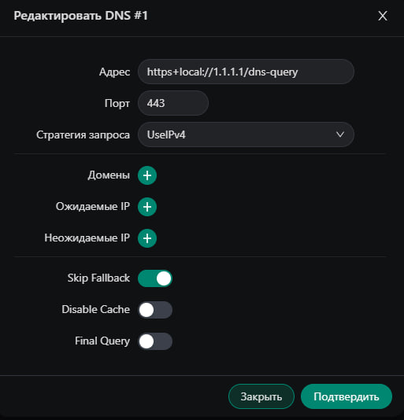

# Multi гайд по настройке для VLESS REALITY XHTTP с SELF STEAL SNI на Ubuntu:

[Как правильно настроить SSH на Linux](#Как-правильно-настроить-SSH-на-Linux)

[Настройка DNS в Ubuntu для адаптера Global](#Настройка-DNS-в-Ubuntu-для-адаптера-Global)

[Настройка DNS в Xray](#Настройка-DNS-в-Xray)

[Установка 3x ui self steal](#Установка-3x-ui-self-steal)

## Как правильно настроить SSH на Linux

Самая надёжная базовая схема такая: создаем отдельного пользователя, входим по SSH-ключу, а административные действия выполняем через sudo. Root-логин напрямую не используем, а вход по паролю и пароль для использования команд sudo отключаем. Тогда даже если кто-то будет круглосуточно «стучаться» в SSH, он упрётся в отсутствие паролей как класса.

1. Генерация публичного (.pub) и приватного ключей на ПК в Windows PowerShell в папке Downloads

```
ssh-keygen -t rsa -b 4096 -f "$HOME\Downloads\id_rsa"
```
2. Настройка нового пользователя (замените USER_NAME на имя вашего пользователя) на вашем сервере

```
sudo adduser USER_NAME
sudo usermod -aG sudo USER_NAME
sudo bash -c 'echo "USER_NAME ALL=(ALL) NOPASSWD:ALL" > /etc/sudoers.d/USER_NAME'
sudo chmod 440 /etc/sudoers.d/USER_NAME
```
3. Подготовка папки ключей и выдача прав (замените USER_NAME на имя вашего пользователя)

```
sudo mkdir -p /home/USER_NAME/.ssh
sudo touch /home/USER_NAME/.ssh/authorized_keys
sudo chown -R USER_NAME:USER_NAME /home/USER_NAME/.ssh
sudo chmod 700 /home/USER_NAME/.ssh
sudo chmod 600 /home/USER_NAME/.ssh/authorized_keys
```

4. Добавление/Замена ключа. Вставьте ваш публичный ключ (содержимое файла .pub с ПК) в редактор:

```
sudo nano /home/USER_NAME/.ssh/authorized_keys
```

5. Перезагружаем SSH 

```
sudo systemctl restart ssh
```
6. Через Windows PowerShell проверяем доступ к серверу по добавленному ключу (обязательно! чтобы не закрыть себе доступ)

```
ssh -i "KEY_PATH" USER_NAME@SERVER_IP
```

Если выдает ошибку, что ключ UNDETECTED нужно отключить наследование для приватного (!!! НЕ .pub) ключа:


*Вместо WINDOWS_USER_NAME пишем имя вашего юзера Windows*


7. Если вы смогли зайти по SSH отключаем пароли и ROOT-вход

```
sudo sed -i -E 's/^#?PermitRootLogin.*/PermitRootLogin no/' /etc/ssh/sshd_config /etc/ssh/sshd_config.d/50-cloud-init.conf
sudo sed -i -E 's/^#?PasswordAuthentication.*/PasswordAuthentication no/' /etc/ssh/sshd_config /etc/ssh/sshd_config.d/50-cloud-init.conf
sudo sed -i -E 's/^#?PubkeyAuthentication.*/PubkeyAuthentication yes/' /etc/ssh/sshd_config /etc/ssh/sshd_config.d/50-cloud-init.conf
sudo sed -i -E 's/^#?KbdInteractiveAuthentication.*/KbdInteractiveAuthentication no/' /etc/ssh/sshd_config /etc/ssh/sshd_config.d/50-cloud-init.conf
```

!!! в папке **/etc/ssh/sshd_config.d/** могут быть и другие файлы .conf, созданные различными программами, поэтому если команда сверху не сработала то имйте ввиду, что какой-то конфиг берет приоритет над **50-cloud-init.conf**

Перезагружаем SSH и проверяем итоговые значения:
```
sudo systemctl restart ssh
```
```
sudo sshd -T | grep -E 'permitrootlogin|passwordauthentication|pubkeyauthentication|kbdinteractiveauthentication'
```

Вывод должен быть:
```
permitrootlogin no
passwordauthentication no 
pubkeyauthentication yes
kbdinteractiveauthentication no
```

## Настройка DNS в Ubuntu для адаптера Global

Если на VPS стоят DNS хостинга, то лучше прописать свои.

```
sudo nano /etc/systemd/resolved.conf
```

В строке #DNS= убираем # и прописываем днс через пробел

Должно получиться (пример): DNS=1.1.1.1 1.0.0.1 8.8.8.8 8.8.4.4

Перезагружаем сервис

```
sudo systemctl restart systemd-resolved
```

Проверка статуса

```
sudo resolvectl status
```

## Настройка DNS в Xray

Заходим в 3x ui, Переходим на вкладку Настройки Xray

Выставляем: 

Настройка стратегии протокола Freedom - ForceIP (или ForceIPv4, если у вас нет IPv6 на vps)

Настройка маршрутизации доменов - IPIfNonMatch

Сохраняем



Переходим на вкладку DNS, включаем

Стратегию запроса оставляем UseIP (или UseIPv4, если у вас нет IPv6 на vps)

Включаем ползунки Отключить резевный DNS, Отключить резевный DNS при совпадении



Нажимаем Создать DNS

Адрес: https+local://1.1.1.1/dns-query

Порт: 443

Стратегия: UseIP (или UseIPv4, если у вас нет IPv6 на vps)

Skip Fallback - Включено



Сохраняем, Перезапускаем Xray

(Можно добавить еще серверов, допустим https+local://8.8.8.8/dns-query или https+local://9.9.9.9/dns-query)

## Установка 3x ui self steal
Вам нужно два домена (панели и селф стил) с днс А записями на айпи вашего VPS

```
wget -qO x-ui-latest.sh https://raw.githubusercontent.com/mozaroc/3x-ui-pro/main/x-ui-latest.sh

bash x-ui-latest.sh -install y -subdomain panel.example.com -reality_domain r.example.com
```

Запускаем скрипт, вводим домены, ждем завершения, в конце копируем данные панели и заходим по ним. 

ВАЖНО! В стоковом состоянии инбаунды оставлять не стоит. Обратить внимание на fingerprint (любой кроме chrome, он заблокирован) и на sniffing (нужно вкл).
