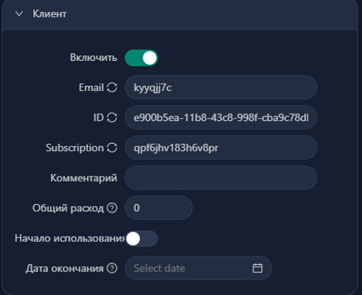

# Multi гайд по настройке для VLESS REALITY XHTTP с SELF STEAL SNI на Ubuntu:

[Как правильно настроить SSH на Linux](#Как-правильно-настроить-SSH-на-Linux)

[Установка и настройка 3x-ui](#Установка-и-настройка-3x-ui)

[Настройка SELF STEAL SNI](#Настройка-SELF-STEAL-SNI)

[Объединение нескольких панелей 3x-ui в подписку для клиентов](#Объединение-нескольких-панелей-3x-ui-в-подписку-для-клиентов)

[Настройка инбаунда VLESS XHTTP REALITY](#Настройка-инбаунда-VLESS-XHTTP-REALITY)

## Как правильно настроить SSH на Linux

Самая надёжная базовая схема такая: создаем отдельного пользователя, входим по SSH-ключу, а административные действия выполняем через sudo. Root-логин напрямую не используем, а вход по паролю и пароль для использования команд sudo отключаем. Тогда даже если кто-то будет круглосуточно «стучаться» в SSH, он упрётся в отсутствие паролей как класса.

1. Генерация публичного (.pub) и приватного ключей на ПК в Windows PowerShell в папке Downloads

```
ssh-keygen -t rsa -b 4096 -f "$HOME\Downloads\id_rsa"
```
2. Настройка нового пользователя (замените USER_NAME на имя вашего пользователя) на вашем сервере

```
sudo adduser USER_NAME
sudo usermod -aG sudo USER_NAME
sudo bash -c 'echo "USER_NAME ALL=(ALL) NOPASSWD:ALL" > /etc/sudoers.d/USER_NAME'
sudo chmod 440 /etc/sudoers.d/USER_NAME
```
3. Подготовка папки ключей и выдача прав (замените USER_NAME на имя вашего пользователя)

```
sudo mkdir -p /home/USER_NAME/.ssh
sudo touch /home/USER_NAME/.ssh/authorized_keys
sudo chown -R USER_NAME:USER_NAME /home/USER_NAME/.ssh
sudo chmod 700 /home/USER_NAME/.ssh
sudo chmod 600 /home/USER_NAME/.ssh/authorized_keys
```

4. Добавление/Замена ключа. Вставьте ваш публичный ключ (содержимое файла .pub с ПК) в редактор:

```
sudo nano /home/USER_NAME/.ssh/authorized_keys
```

5. Перезагружаем SSH 

```
sudo systemctl restart ssh
```
6. Через Windows PowerShell проверяем доступ к серверу по добавленному ключу (обязательно! чтобы не закрыть себе доступ)

```
ssh -i "KEY_PATH" USER_NAME@SERVER_IP
```

Если выдает ошибку, что ключ UNDETECTED нужно отключить наследование для приватного (!!! НЕ .pub) ключа:


*Вместо WINDOWS_USER_NAME пишем имя вашего юзера Windows*


7. Если вы смогли зайти по SSH отключаем пароли и ROOT-вход

```
sudo sed -i -E 's/^#?PermitRootLogin.*/PermitRootLogin no/' /etc/ssh/sshd_config /etc/ssh/sshd_config.d/50-cloud-init.conf
sudo sed -i -E 's/^#?PasswordAuthentication.*/PasswordAuthentication no/' /etc/ssh/sshd_config /etc/ssh/sshd_config.d/50-cloud-init.conf
sudo sed -i -E 's/^#?PubkeyAuthentication.*/PubkeyAuthentication yes/' /etc/ssh/sshd_config /etc/ssh/sshd_config.d/50-cloud-init.conf
sudo sed -i -E 's/^#?KbdInteractiveAuthentication.*/KbdInteractiveAuthentication no/' /etc/ssh/sshd_config /etc/ssh/sshd_config.d/50-cloud-init.conf
```

!!! в папке **/etc/ssh/sshd_config.d/** могут быть и другие файлы .conf, созданные различными программами, поэтому если команда сверху не сработала то имйте ввиду, что какой-то конфиг берет приоритет над **50-cloud-init.conf**

Перезагружаем SSH и проверяем итоговые значения:
```
sudo systemctl restart ssh
```
```
sudo sshd -T | grep -E 'permitrootlogin|passwordauthentication|pubkeyauthentication|kbdinteractiveauthentication'
```

Вывод должен быть:
```
permitrootlogin no
passwordauthentication no 
pubkeyauthentication yes
kbdinteractiveauthentication no
```

## Установка и настройка 3x-ui

3x-ui на данный момент самая юзер френдли панель для xray. 

Изначально установим пакеты:
```
apt update && apt upgrade -y
apt install -y curl nano cron
systemctl enable --now cron

curl https://get.acme.sh | sh
source ~/.bashrc
```

Ручная установка 3x-ui:
```
bash <(curl -Ls https://raw.githubusercontent.com/mhsanaei/3x-ui/master/install.sh)
```

При установке оставляем все по умолчанию, протыкиваем везде Enter, самоподписанный сертификат будет выдан на ваш IP через Acme.
В конце установки вам будут выданы Логин, Пароль и Ссылка на вашу панель:


Обязательно прописываем x-ui, выбираем пункт Enable BBR, 1, Enter

## Настройка DoH в XRAY

Заходим в панель в браузере 

Настройки Xray - Основное 

Настройка стратегии протокола Freedom: ForceIP (если у вас есть IPv6) или ForceIPv4 (если только IPv4)

Настройка маршрутизации доменов IPIfNonMatch


Настройки Xray - DNS

Стратегия запроса: UseIP (если у вас есть IPv6) или UseIPv4 (если только IPv4)

Включить параллельные запросы - включаем


Нажимаем создать DNS

Адрес https://1.1.1.1/dns-query (и вторую запись но с https://8.8.8.8/dns-query)

Порт 443

Стратегия запроса UseIP (если у вас есть IPv6) или UseIPv4 (если только IPv4)

Skip Fallback - отключаем


Перезагружаем Xray

## Настройка SELF STEAL SNI 

(https://github.com/YukiKras/wiki/blob/main/selfsni.md)

Для начала вам нужно приобрести домен и создать DNS A запись, чтобы за доменом стоял айпи вашего vps:

A @ ВАШ_IP

Как только на 2ip.ru увидите, что ваш домен привязан к вашему айпи, запускаем скрипт:
```
bash <(curl -Ls https://raw.githubusercontent.com/YukiKras/vless-scripts/refs/heads/main/fakesite.sh)
```

Вводим ваш домен

Скрипт выдаст пути к сертификатам (Certbot), ваши TARGET (DEST) и SNI, а также создаст сайт заглушку на Nginx. Копируем пути к сертфикатам (/etc/letsencrypt/live/your-domain.com/fullchain.pem /etc/letsencrypt/live/your-domain.com/privkey.pem), TARGET (DEST) и SNI

Теперь нам нужно сменить сертификаты панели на новые (т.к. будет конфликт за 80 порт, когда Acme решит продлить ваши сертификаты на IP) и удалить задачу автозапуска Acme из crontab

Заходим в панель в браузере - Настройки 

Домен панели - вводим ваш домен, на который выдавались сертификаты

Во вкладке Сертификаты вставляем пути, которые вам выдал скрипт формата (/etc/letsencrypt/live/your-domain.com/fullchain.pem /etc/letsencrypt/live/your-domain.com/privkey.pem)


Нажимаем Перезапуск панели 

Узнать новую ссылку можно прописав в консоль x-ui и выбрав пункт View current settings

Теперь удаляем задачу ACME из crontab
```
~/.acme.sh/acme.sh --uninstall-cronjob
/root/.acme.sh/acme.sh --uninstall-cronjob
```

Проверяем:
```
crontab -l | grep -E "acme.sh|--cron"
```

Должно быть пусто

Перезапускаем x-ui:
```
sudo systemctl restart x-ui
```

## Объединение нескольких панелей 3x-ui в подписку для клиентов 

(https://github.com/apa4h/nginx-3x-ui-subscription-proxy)

Установка Docker:
```
curl -fsSL https://get.docker.com | sh
```

Клонируем с гитхаба:
```
git clone https://github.com/apa4h/nginx-3x-ui-subscription-proxy.git
```

```
cd nginx-3x-ui-subscription-proxy
```

```
cp .env.template .env
```

```
nano .env
```

Пример конфига:
```
PATH_SSL_KEY=/etc/letsencrypt/live/example.com/
SITE_HOST=example.com
SITE_PORT=ВАШ_ПОРТ
SERVERS="https://server1.com:2096/sub/ https://server2.com:2096/sub/"
SUB=sub
TLS_MODE=on
```

В PATH_SSL_KEY и SITE_HOST вводим наш домен вместо example.com

SITE_PORT выбираем свободный порт (не забываем открыть его, а также 2096 в файрволе)

В SERVERS вводим ссылки на ваши панели

TLS_mode ставим on

Собираем контейнер:
```
docker compose up -d
```

Если нужно остановить:
```
docker compose down
```

Далее в инбаундах 3x-ui в указанных панелях нужно в настройках Клиентов указать одинаковый SUBSCRIPTION, который мы и укажем в ссылке на подписку. Клиенты с этим SUBSCRIPTION будут автоматически подтягиваться в подписку.



Ссылка на подписку: https://example.com:ВАШ_ПОРТ/sub/ВАШ_SUBSCRIPTION

## Настройка инбаунда VLESS XHTTP REALITY

Порт 443


Транспорт XHTTP

Хост ваш-домен

Путь /любой/длинный/путь/


Безопасность Reality

Xver 1

Target ваш-скопированный-target
SNI ваш-домен

Генерируем сертификаты кнопкой Get New Cert

Обязательно включаем Sniffing, чтобы корректно работала маршрутизация


